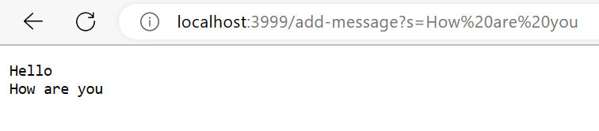
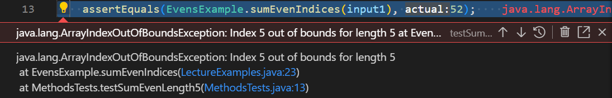

# Part 1
Introduction: This lab report involves writing a web server called **StringServer** based off the NumberServer and the identifying a bug based on failure inducing JUnit tests



* String handleRequest() is the primary method that is called 
* Relevant fields include the parameters array and String word and String s which are used to display on the page 
* s begins as an empty String to which will later include the user input
* word is intitialized as an emptry String as well
* If s is not a null value, word will take on s's value and concatenate with the index one of the array parameter{} 
* A value such as String word is changed depending on whether or not an array is null or not.

# Part 2
## Testing buggy implementation 
### Tests using JUnit 
`public void  testSumsEvensLength4(){`
`int[] input1{12, 13, 7, 2};`
`assertEquals(EvensExample.sumEvenIndicies(input1), 19); }`
 


`public void testSumEvenLength6(){`
`int[] input1 = { 12, 13, 7, 8, 5, 3};`
`assertEquals(EvensExample.sumEvenIndices(input1), 24); }`



> EvensExample code prior to fix: 
```
class EvensExample{
 static int sumEvenIndicies(int[] num){
  int sum = 0;
  for(int i = 0; i < nums.length - 1; i+=2){
   sum+= nums[i + 1];
   }
  return sum;
 }
}
 ```
> Fix of EvensExample so that different array lengths pass the tests:

```
class EvensExample{
 static int sumEvenIndicies(int[] num){
  int sum = 0;
  for(int i = 0; i < nums.length; i+=2){
   sum+= num[i];
   }
   return sum;
 }
}
```
 
>Fix of EvensExample so that arrays of length 5 are able to pass tests

# Part 3 
> One thing that I learned and found intersting from Lab 2 was the entire process of developing and running a local web server on a Java terminal. I found it very interesting to see something that I created on my laptop to have its own domain and be able to be found locally on the Internet. 
