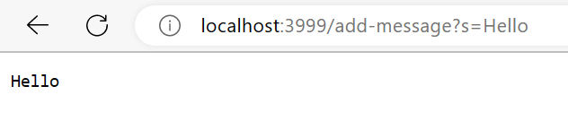

# Part 1

* String handleRequest() is the primary method that is called 
* Relevant fields include the parameters array and String word and String s which are used to display on the page 
* A value such as String s is changed depending on whether or not an array is null or not. If it is not null, s equals the value of word

# Part 2
`public void  testSumsEvensLength4(){
`int[] input1{12, 13, 7, 2};
`assertEquals(EvensExample.sumEvenIndicies(input1), 19);
`}
*
`public void testSumEvenLength6() {
`int[] input1 = { 12, 13, 7, 8, 5, 3};
`assertEquals(EvensExample.sumEvenIndices(input1), 24);
`}
